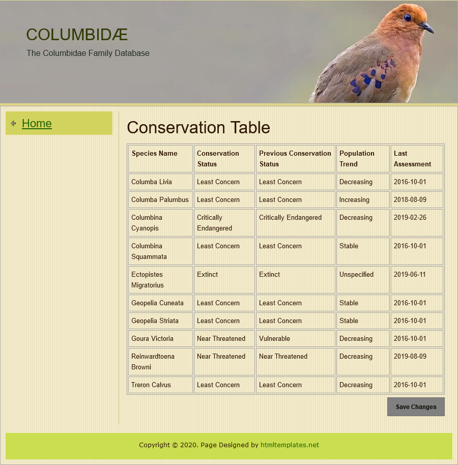
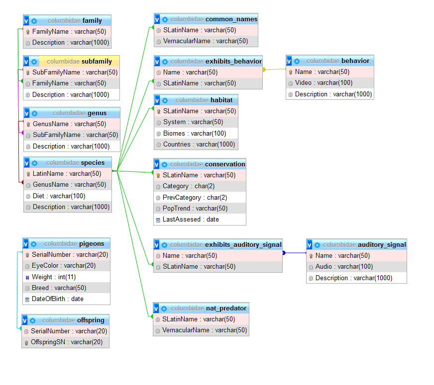

# A demonstrative database built using MySQL and PHP

[](exhibition/home.png)
---
[](exhibition/conservation.png)

# Setting up the Development Environment

## Setting up the front-end on LocalHost:

1. Download [WampServer](https://www.wampserver.com/) (Apache based PHP, MySQL compatable server)
2. After you've gone through the <b>default</b> installation process, start the Wampserver64 on your computer
3. Empty the `server home directory` which can be found on your computer at the following address `C:\wamp64\www` and copy the contents of `public_html` from your cloned repository into `server home directory`

## Setting up the MySQL database:
4. Open `http://localhost/phpmyadmin/index.php` in your browser
5. The default username is set to `root` and the password field should be left empty
6. Set the server choice to to MySQL and login
- Optional: It is recommmended you create a password for the root account
7. Open the 'User Accounts' tab
8. Create a new account with the username 'columbidae' and check the "Create database with the same name and grant all privileges" box under the "Database for user account" section.  Keep note of your username and password, you'll need to use the credentials later. 
9. A database with the same name as your account should appear in the left panel.  Click on it, then go to the 'Import' tab. 
10. Import `columbidae.sql`, the file is located in the root directory of your cloned repository.  Leave all other options at their default settings, and click the "Go" button to begin importing the database.

- Once the import has successfully completed, you should see a message similar to:
```
Import has been successfully finished, 157 queries executed. (columbidae.sql)
```
- The selected database in the left panel will populate with all the imported tables and stored procedures. 

## Configuring the Environment Variables:

1. In order to use environment variables (and make the database accessible to the front-end) you'll need to download and install [Composer](https://getcomposer.org/download/) if you haven't already.  

The following configuration was used during composer installation:   
- Install for all users
- Command-line php: `C:\wamp64\bin\php\php5.6.40\php.exe` (php version may be different)
- No proxy
- php was added to PATH

You can verify that the installation was successful by running `php --version` and `composer --version` in a new instance of  Windows Powershell.  If the command was not recognized, a computer restart may be required. 

2. Open the Windows Powershell and navigate to the `server home directory`, once inside the directory execute the following command: 
```PowerShell
composer install
```
- This will install the dependencies required to make environment variables work with php.

3. Open the .env file in the `server home directory` and configure the parameters to match your credentials, it should look something like this:
```env
DB_HOST=localhost
DB_USERNAME=columbidae
DB_PASSWORD=some_random_password
DB_DBNAME=columbidae
DB_PORT=3308
```
- The `DB_PASSWORD` should be the same password you used when you created your MySQL account
- You can check which port MySQL is using by right clicking on the WampServer system tray icon, selecting 'tools', the port will be listed in one of the blue section dividers

## You're all set to go!

You can now view all the tables and make changes to them using the available prodecures on the home page!  If you wish to reset the database, you'll have to re-import it (see step 10 in [Setting up the MySQL database](#,""))

# Additional information

## Software Versions Used:


<br>

<br>

<br>

<br>


## Database Schematic:
[](exhibition/schematic.png)